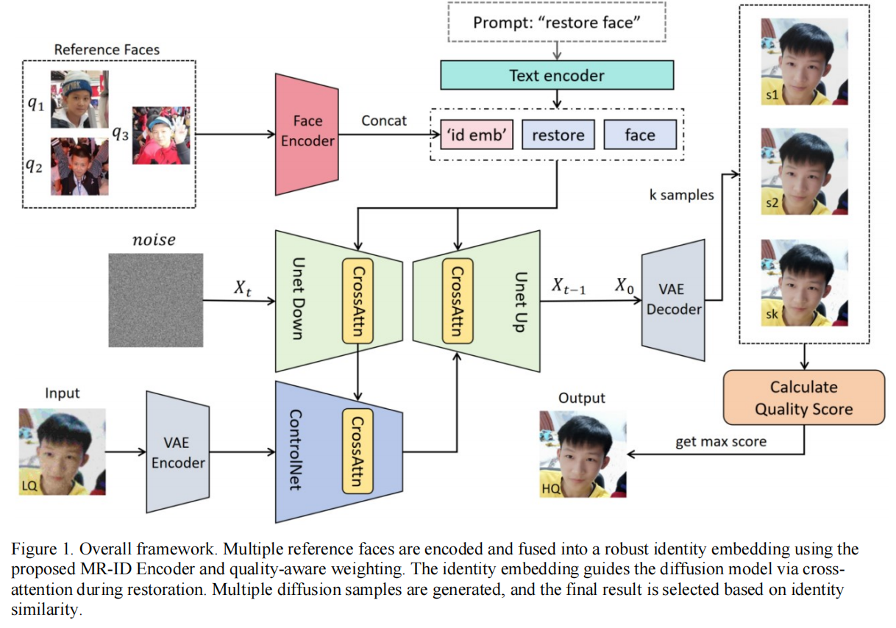
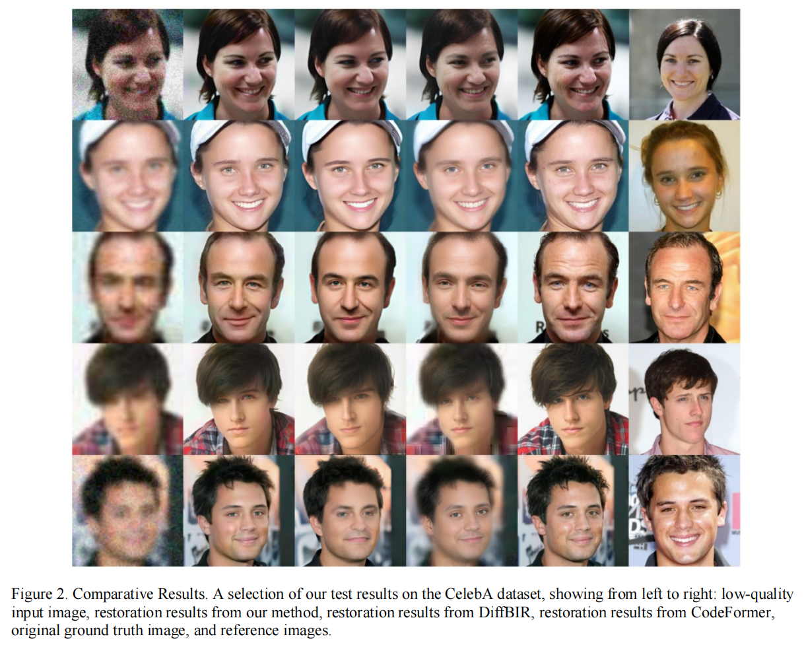
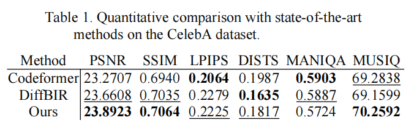
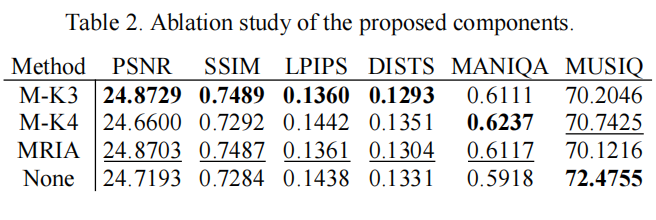
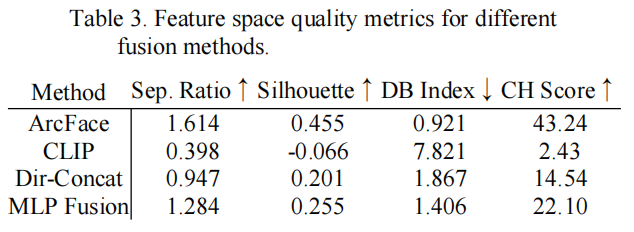

# 基于扩散模型的定制化人像恢复方法研究与应用
桂林电子科技大学-国家级大学生创新训练项目：《基于扩散模型的定制化人像恢复方法研究与应用》

---

## 摘要
In recent years, face restoration technology has become a research hotspot in image enhancement. While traditional methods effectively improve image quality, they often struggle to maintain identity consistency. To address this limitation, we propose an identity-preserving restoration framework enhanced by a Multi-Reference Identity Encoder and Iterative Diffusion Refinement to simultaneously enhance both the visual quality and identity preservation of reconstructed faces. The system extracts facial feature embeddings, which are fused with multiple reference faces and concatenated with textual prompts to guide the restoration process. In addition, we employ an iterative diffusion refinement strategy to select the face with the highest identity consistency from multiple diffusion outputs. Experiments on the CelebA dataset demonstrate that our method performs comparably or superiorly to current mainstream and state-of-the-art methods in both visual quality and identity similarity.

## 总体框架

## 定性对比

## 定量对比

## 消融实验

